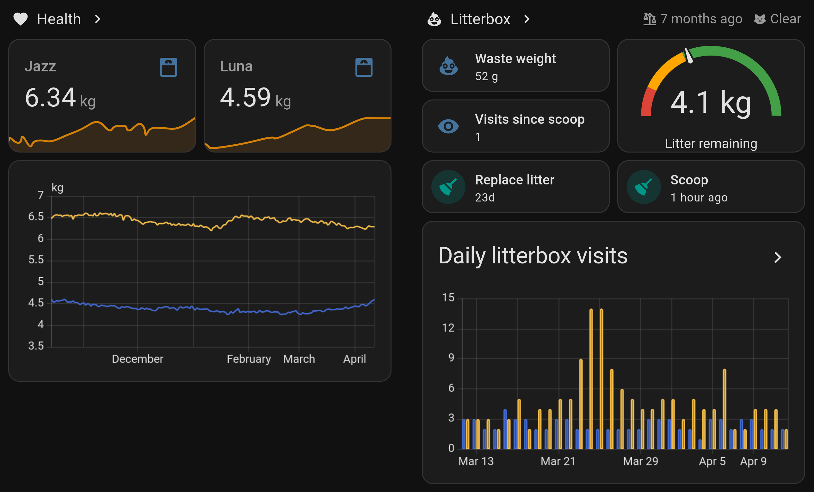

# ESPHome Litterbox Monitor

A smart litterbox monitor powered by ESPHome and an ESP32, designed to track
cat visits, waste, and litter status using load cells.



## Features

- **Weight tracking:** Measures total litterbox weight and detects changes.
- **Multiple cat detection:** Identifies cats by weight (supports at least two cats).
- **Waste weight tracking:** Tracks total accumulated waste after each visit.
- **Remaining litter tracking:** Calculates remaining litter after clean events.
- **Deep clean / replace litter reminder:** Notifies when it's time to change litter.
- **Clean event detection:** Detects and resets waste/litter counters after removing waste.
- **Visit counting:** Tracks the number of cat visits between cleans.
- **Automatic tare:** Maintains accurate zeroing of the scale.
- **Home Assistant integration:** All sensors and actions are available in Home Assistant.

## How to Use

### Initial calibration

1. Take the approximate weight of your cats and populate the `initial_value`
   of each of their `cat1_weight`,`cat2_weight`,etc. sensors.

   This can be easily done with weighing yourself on a bathroom scale,
   then weighing yourself again while holding your cat, and
   subtracting the difference.

2. Set down the constructed base without anything on top on a **flat and level** surface.
   Use shims if you need to.
3. Wait for it to settle, then note the `Unfiltered Weight` value. This is the `0` value.
4. Take some weights (e.g. a 5L bottle, or multiple 2L bottles) and measure them
   on a known good scale (e.g. a kitchen scale with 1 gram accuracy)
5. Set the weights on the base, and after a few seconds to settle, note the
   `Unfiltered Weight` value again.
6. In the YAML configuration, replace the values in the `calibrate_linear`
   section of the `hx711_value` sensor with your values in kilograms. e.g.
   ```yaml
   - calibrate_linear:
       - 205901 ->  0.0 # raw measured zero value -> 0
       - 1794742 -> 12.441 # raw measured known value -> known kilogram weight
   ```
7. Note the empty litterbox weight. If it's too heavy or doesn't physically fit
   on a kitchen scale with gram accuracy, you can flash the calibrated config
   from step 6, trigger the `Reset Clean` button, set the empty litterbox on
   top of the base, and note down the `Tared Weight` sensor reading.

   Set this as the `initial_value` for the `litterbox_weight` sensor.

8. Flash the config, set the litterbox on top, add the litter and trigger the
   `Reset clean` button. The monitor is now ready to be used.

### Adding Extra Cats

By default, the current configuration supports two cats. To add more cats:

- Add new global variables for each cat's weight (e.g., `cat3_weight`).
- Add new template sensors for each cat.
- Update the `set_cat_weight` API service and detection logic to handle additional cats.

### Actions (Services)

- `set_cat_weight`: Set a cat's weight manually via Home Assistant or API.
  - Parameters: `cat` (int), `weight` (float)
  - Example: To set Cat 1's weight to 5.2kg, call `set_cat_weight` with `cat=1`, `weight=5.2`.

### Synchronize Multiple Litterboxes

If you have multiple litterboxes, use a Home Assistant automation to synchronize cat weights:

When a cat's weight is updated on one litterbox, trigger the `set_cat_weight` action on the others.

## Hardware

### Load Cell Amplifier

- Any HX711 breakout board will work.
- Boards with separate `VCC` (5V for load cells) and `VDD` (3.3V for ESP32 logic) are recommended for best accuracy.
  - Known good example: [Sparkfun HX711 v1.1](https://www.sparkfun.com/sparkfun-load-cell-amplifier-hx711.html)
  - _BEWARE_ Some no-name breakout boards have separate `VCC` and `VDD` pins but
    electrically tie them together. Supplying 5V to these _will_ kill the esp chip.
    Validate these with a multimeter before applying power.

### Load Cells

- 4 × 10kg strain gauge load cells (commonly available on AliExpress).
- Choose the load cell capacity based on:
  - Baseboard + litterbox + litter + heaviest cat + jumping force + safety buffer, divided by 4.
- Higher capacity load cells reduce measurement resolution.

### ESP32

- Any ESP32 devkit board is compatible.

### Litterbox

- For large breeds, the [IKEA SAMLA 79x57x18 cm/55 l](https://www.ikea.com/us/en/p/samla-box-with-lid-clear-s39440814/#content)
  is a good DIY litterbox.
- Can be paired with a suitable [IKEA KOMPLEMENT](https://www.ikea.com/gb/en/p/komplement-shelf-white-90277961/)
  shelf as a base.

## Sensors and Entities

- **Cat 1/2 Weight:** Current weight of each cat.
- **Waste Weight:** Estimated total accumulated waste (grams) since last clean.
- **Litter Remaining:** Estimated remaining litter (kg).
- **Visits:** Number of cat visits since last clean.
- **Deep Clean Timer:** Days left until next recommended deep clean / litter change.
- **Occupancy, Activity, Vibration, Cat Event:** Diagnostic sensors for event detection.
- **Raw/Unfiltered/Tared Weight:** Diagnostic weight readings.

## Buttons

- **Reset Deep Clean Timer:** Resets the deep clean countdown.
- **Reset Clean:** Resets tare, litter, waste, and visit counters.

  Only required if the automatic clean detection failed.

## TODO

- Distinguish urination/defecation/no-waste events.
- Calculate trends and alert for outliers.
- Distinguish cats of similar weight.
- Automatic deep clean detection.
- Runtime assisted calibration.
- Easier adding/removing of pets.
- Error state detection (debris stuck underneath, box misaligned)

## Acknowledgements

- [Andy Bradford's Blog post](https://andybradford.dev/2022/06/02/internet-of-poop-how-and-why-i-built-a-smart-litter-tray/)
  for the initial inspiration
- [markusressel/ESPHome-Smart-Scale](https://github.com/markusressel/ESPHome-Smart-Scale) for
  the auto-tare smart scale code
- [DIY Cat Village](https://www.youtube.com/watch?v=PIszxXKy8H4) Youtube channel for the IKEA litterbox hack
- [Purina Petivity](https://www.petivity.com/products/smart-litter-box-monitor)
  for not offering an XL version and propelling this DIY project.

## Contributing

Feel free to open an issue or pull request.
