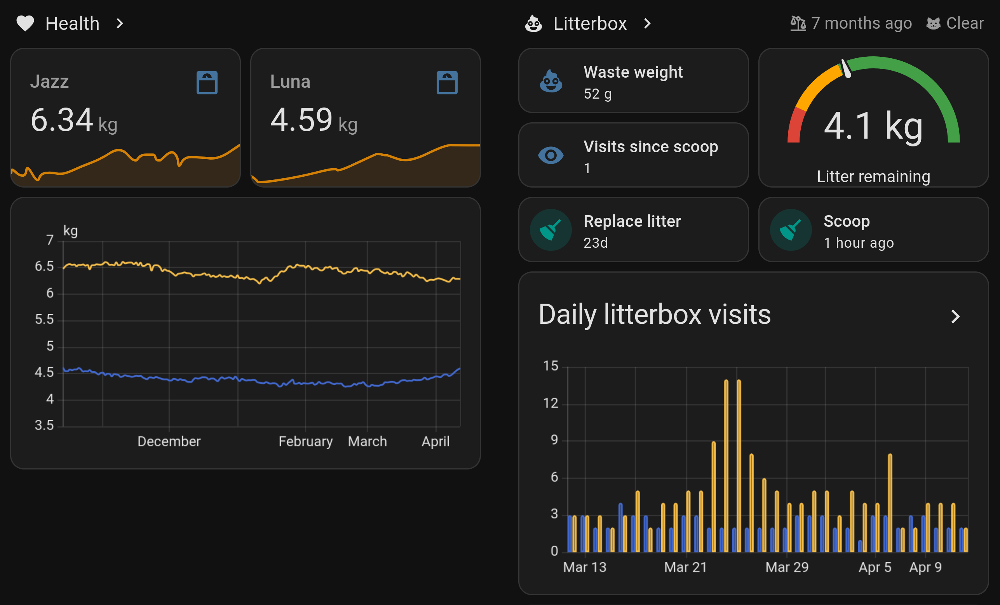

# ESPHome Litterbox Monitor

A smart litterbox monitor powered by ESPHome and an ESP32, designed to track
cat visits, waste, and litter status using load cells.

## Features

- **Weight tracking:** Measures total litterbox weight and detects changes.
- ***PoopSense* waste recognition:** Recognizes #1 from #2. [How it works ->](docs/POOPSENSE.md)
- **Multiple cat detection:** Identifies cats by weight (supports 1-5 cats).
- **Waste weight tracking:** Tracks total accumulated waste after each visit.
- **Remaining litter tracking:** Calculates remaining litter after clean events.
- **Deep clean / replace litter reminder:** Notifies when it's time to change litter (configurable interval).
- **Clean event detection:** Detects and resets waste/litter counters after removing waste.
- **Visit counting:** Total visits since clean plus per-cat daily visits.
- **Automatic tare:** Maintains accurate zeroing of the scale.
- **Home Assistant integration:** All sensors and actions are available in Home Assistant.

## How to Use

### Hardware Setup

Update the configuration with the correct GPIO pins for your HX711,
as you have wired it to your ESP32.

Change the timezone substitution to your local timezone.

Ensure your `secrets.yaml` defines `litterbox_api_key`, `litterbox_ota_password`,
`litterbox_ap_password`, `wifi_ssid`, and `wifi_password`.

Both [`litterbox-monitor.yaml`](litterbox-monitor.yaml) and [`state_analyzer.h`](state_analyzer.h) must be in the same directory (clone the repo or copy both files).

### Configuring Cats

This configuration supports 1-5 cats out of the box. The example substitutions 
shows two cats, but you should configure this before first flashing:

- Update the `cats` substitution in the YAML configuration to include your 
  cat names (e.g., "Fluffy", "Whiskers", "Mittens"). Add or remove from the list
  as needed.
- Only the cats you define will have corresponding weight and daily visit 
  sensors available in Home Assistant.
- After flashing, use the `set_cat_weight` API service to set the weight 
  for each cat (See Initial Calibration section below).

### Initial calibration

Tools required: Kitchen scale, Bathroom scale, weights totalling 4~5kg.

1. Take your weights and measure them to the nearest gram
   on a known good kitchen scale.
   - Note: All scales become inaccurate nearing their maximum capacity.
           For example, with a "5kg max" scale, measure 2 x 2L bottles of 
           water and sum their weights instead of one 5L bottle for best results.

2. Set the `Calibration Known Weight` number entity to the weight 
   you measured (in grams).

3. Make sure the constructed base is **without anything on top**, resting on
   a **flat and level** surface. Use shims if you need to.

4. Press the `Calibrate Scale` button. This will capture the zero point (tare).

5. Place the known weights on the base and press the `Calibrate Scale` 
   button again. This will complete the calibration process.
   
   The "Raw weight" sensor should now read the weight you placed on it,
   and the "Calibration Last Performed" sensor should read the current time.
   If this is not the case, consult the ESPHome logs for errors and repeat
   steps 2-5.
   
6. ***Optional*** Fill in "Empty Box Weight" number entity to the weight of the
    empty litterbox (in grams). This will improve the accuracy of the
    "Litter Remaining" sensor. You can place the box on the monitor and read
    the "Raw weight" sensor to get this value.

7. Set the litterbox on top, add the litter and trigger the `Reset clean` button.

8. Take the approximate weight of your cats (within 10%).

   This can be easily done with weighing yourself on a bathroom scale,
   then weighing yourself again while holding each cat, and
   subtracting the difference.

   Use the `set_cat_weight` action within Home Assistant to set 
   an initial value for each cat's weight, in the order you defined them
   in the configuration (see Actions section below).

The monitor is now ready to be used.

### Actions (Services)

- `set_cat_weight`: Set a cat's weight manually via Home Assistant or API.
  - Parameters: `cat` (int, 1-5), `weight` (float)
  - Example: To set Cat 1's weight to 5.2kg, call `set_cat_weight` with `cat=1`, `weight=5.2`.

### Synchronize Multiple Litterboxes

If you have multiple litterboxes, use a Home Assistant automation to synchronize cat weights:

When a cat's weight is updated on one litterbox, trigger the `set_cat_weight` action on the others.

## Hardware

Follow this great [SparkFun HX711 Hookup Guide](https://learn.sparkfun.com/tutorials/load-cell-amplifier-hx711-breakout-hookup-guide/all) for assembly instructions.

### Load Cell Amplifier

- Any HX711 breakout board will work, BUT:
- Boards with separate `VCC` (5V for load cells) and `VDD` (3.3V for ESP32 logic) are recommended for best accuracy.
  - Recommended, known good example: [Sparkfun HX711 v1.1](https://www.sparkfun.com/sparkfun-load-cell-amplifier-hx711.html)
  - _BEWARE_ Some no-name breakout boards have separate `VCC` and `VDD` pins but
    electrically tie them together. Supplying 5V to these _will_ kill the esp chip.
    Validate these with a multimeter before applying power.

### Load Cells

- 4× 5-10kg strain gauge load cells (commonly available on AliExpress).
- Choose the load cell capacity based on:
  - Baseboard + litterbox + litter + (heaviest cat × 2 for jump impact) × 1.5 safety margin.
  - Example: normal setup (average cat): (1 kg baseboard + 0.5 kg box + 2.5 kg litter + 5 kg cat × 2) × 1.5 = **21 kg** -> 24~32 kg cells (4× 6~8kg)
  - Example: XL setup (large cat): (1.5 kg box + 5 kg litter + 10 kg cat × 2) × 1.5 = **39.75 kg** -> 40 kg cells (4× 10kg)
- For normal weight tracking and occupancy detection, any sensibly sized load cell set will work.
- Higher capacity load cells reduce measurement resolution.
- For PoopSense event-type classification, see the
  [detailed load cell selection table](docs/POOPSENSE.md#resolution-table).

### ESP32

- Any ESP32 devkit board is compatible.

### Litterbox

- For large breeds, the [IKEA SAMLA 79x57x18 cm/55 l](https://www.ikea.com/us/en/p/samla-box-with-lid-clear-s39440814/#content)
  is a good DIY litterbox.
- Can be paired with a suitable [IKEA KOMPLEMENT](https://www.ikea.com/gb/en/p/komplement-shelf-white-90277961/)
  shelf as a base.

## Sensors and Entities

- **Cat 1-5 Weight:** Last weight stored for each cat when PoopSense identifies
  them on a visit (only enabled cats are visible).
- **Cat 1-5 Daily Visits:** Number of visits per day for each cat (only enabled cats are visible).
- **Elimination Type:** Text sensor reporting `no_elimination`,
  `urination`, `defecation`, `both`, or `unknown` after each analyzed activity.
- **Event Duration:** Seconds for the activity window that was analyzed (updated
  when PoopSense runs at the end of activity).
- **Waste Weight:** Estimated total accumulated waste (grams) since last clean.
- **Litter Remaining:** Estimated remaining litter (kg).
- **Visits:** Number of cat visits since last clean.
- **Deep Clean Timer:** Days left until next recommended deep clean / litter change.
- **Cat Weight:** Diagnostic sensor (disabled by default) showing the cat weight
  in kg from the last PoopSense result.
- **Occupancy, Activity, Vibration:** Diagnostic sensors for physical presence,
  combined activity, and scale jitter.
- **Cat Event:** Diagnostic occupancy-style hint when tared weight is close to a
  known cat for 2+ seconds (used internally for activity; PoopSense does the
  full visit analysis when activity ends).
- **Raw/Unfiltered/Tared Weight:** Diagnostic weight readings.

## Number Entities

- **Litter Change Interval:** Configure the number of days between deep clean reminders (7-30 days, default: 30).
- **Classification Threshold:** Standard deviation threshold (in grams) that separates urination from defecation. The default of 4 g works well out of the box; raise it if defecation events are being over-reported, lower it if they're being missed.  See [PoopSense](docs/POOPSENSE.md) for details.
- **Calibration Known Weight:** Weight of calibration objects used during scale setup.
- **Empty Box Weight:** Weight of the empty litterbox for improved litter remaining calculations.

## Buttons

- **Reset Deep Clean Timer:** Resets the deep clean countdown.
- **Reset Clean:** Resets tare, litter, waste, and visit counters.

  Only required if the automatic clean detection failed.

## TODO

- [x] Runtime assisted calibration.
- [x] Easier adding/removing of pets.
- [x] Distinguish urination/defecation/no-waste events.
- [ ] Automatic periodic calibration using the empty litterbox weight.
- [ ] Calculate trends and alert for outliers.
- [ ] Distinguish cats of similar weight.
- [ ] Automatic deep clean detection.
- [ ] Error state detection (debris stuck underneath, box misaligned)

## Acknowledgements

- [Andy Bradford's Blog post](https://andybradford.dev/2022/06/02/internet-of-poop-how-and-why-i-built-a-smart-litter-tray/)
  for the initial inspiration
- [markusressel/ESPHome-Smart-Scale](https://github.com/markusressel/ESPHome-Smart-Scale) for
  the auto-tare smart scale code
- [DIY Cat Village](https://www.youtube.com/watch?v=PIszxXKy8H4) Youtube channel for the IKEA litterbox hack
- [Purina Petivity](https://www.petivity.com/products/smart-litter-box-monitor)
  for not offering an XL version and propelling this DIY project.

## Contributing

Feel free to open an issue or pull request.
