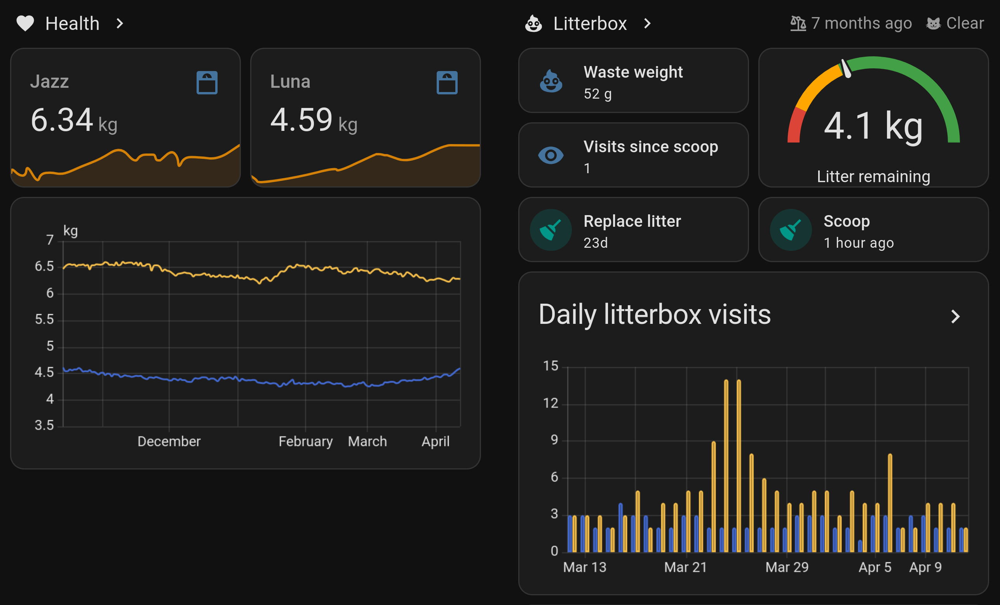

# ESPHome Litterbox Monitor

A DIY smart litterbox: four load cells under the box, an HX711, and an
ESP32 running ESPHome. A state analyzer on the chip turns the raw 10 Hz
weight signal into everything listed below — no camera, no cloud, no
external compute — and surfaces it in Home Assistant as native sensors,
buttons, and actions.

## Features

- **Knows which cat is which.** Identifies visiting cats by weight (up to 5)
  and tracks each cat's weight over time — no collars, no cameras.
- **Logs every visit.** Per-cat daily counts of visits, pees, and poops,
  plus visit duration and total visits since the last scoop.
- ***PoopSense.*** Tells #1 from #2 using nothing but the weight signal.
  [How it works ->](docs/POOPSENSE.md)
- **Tells you when to scoop.** Tracks how much waste has piled up since the
  last clean — and detects the clean itself, so the counters reset on their
  own when you scoop.
- **Tells you when to deep clean, and notices when you do.** Configurable
  reminder for full litter changes; put the washed box back empty and the
  timer restarts on its own. [How it works ->](docs/BOX_TRACKING.md)
- **Watches the litter level.** Estimates how much litter is left in the box
  so you know when to top up, and counts each bag you pour in.
- **Takes care of itself.** Re-zeroes against the bare board whenever the box
  comes off, and tells a scoop from a top-up from you lifting the whole thing
  to clean underneath.

## What You Need

### Load cells

- 4× strain gauge load cells, one per corner of the baseboard (commonly
  available on AliExpress); 5-12.5 kg each covers most setups.
- Sizing is a balancing act: strong enough to survive the cat's landing,
  small enough that PoopSense can still see grams. For a typical
  single-cat setup, 4× 6-8 kg cells hit the sweet spot.
- The full math — sizing formula, worked examples, and resolution table —
  lives in the **[load cell sizing guide](docs/LOAD_CELLS.md)**.

### Load cell amplifier (HX711)

- Any HX711 breakout board will work, BUT:
- Boards with separate `VCC` (5V for load cells) and `VDD` (3.3V for ESP32 logic) are recommended for best accuracy.
  - Recommended, known good example: [Sparkfun HX711 v1.1](https://www.sparkfun.com/sparkfun-load-cell-amplifier-hx711.html)
  - _BEWARE_ Some no-name breakout boards have separate `VCC` and `VDD` pins but
    electrically tie them together. Supplying 5V to these _will_ kill the esp chip.
    Validate these with a multimeter before applying power.

### ESP32

- Use a variant with a **hardware FPU**: the ESP32-S3 (what the config
  targets — the development build runs on an ESP32-S3 Super Mini) or the
  classic ESP32. For a classic ESP32 set `board: esp32dev`, drop
  `flash_size`, and pick pins that exist on it.
- PoopSense leans on float math — per-sample filtering at 10 Hz and
  standard-deviation crunching at 0.1 g precision after every visit — so
  variants that emulate floats in software (S2, C3, C6) are untested.

### Litterbox and base

- For large breeds, the [IKEA SAMLA 79x57x18 cm/55 l](https://www.ikea.com/us/en/p/samla-box-with-lid-clear-s39440814/#content)
  is a good DIY litterbox.
- Can be paired with a suitable [IKEA KOMPLEMENT](https://www.ikea.com/gb/en/p/komplement-shelf-white-90277961/)
  shelf as a base.

### Calibration tools

You'll also want these on hand for the calibration step later:

- A known good kitchen scale.
- A bathroom scale (for weighing the cats).
- Calibration weights adding up to roughly your everyday load — box +
  litter + cat (~20 kg on the XL build). Several small water bottles work
  great; one big jug does not — see [Calibration](#calibration) for why.

## Assembly

Follow this great [SparkFun HX711 Hookup Guide](https://learn.sparkfun.com/tutorials/load-cell-amplifier-hx711-breakout-hookup-guide/all)
for wiring the load cells to the HX711 and mounting them under the baseboard.

Wire the HX711 to the ESP32. The configuration defaults to:

| HX711 pin | ESP32-S3 pin |
|---|---|
| `DOUT` / `DT` | `GPIO13` |
| `SCK` / `CLK` | `GPIO12` |

You can use different pins — just update the `hx711` sensor section of the
YAML to match your wiring.

## Firmware Setup

1. Clone this repo (or copy [`litterbox-monitor.yaml`](litterbox-monitor.yaml),
   [`state_analyzer.h`](state_analyzer.h), [`visit_blob.h`](visit_blob.h) and
   [`visit_store.h`](visit_store.h) into the same directory — all four are
   required).

2. Create a `secrets.yaml` next to them defining:
   `wifi_ssid`, `wifi_password`, `litterbox_api_key`, `litterbox_ota_password`,
   `litterbox_ap_password`, and `mqtt_broker` (host or IP of an MQTT broker).
   Home Assistant talks to the device over the native API as before; the
   broker only receives the visit record — every sample the analyzer saw,
   plus its verdict — so a visit can be replayed off the device. Each visit
   is one retained message, journaled to a 512 KB flash partition first and
   shipped from there, so a broker that was down for a week gets every
   visit when it comes back. The `mqtt:` block carries placeholder
   credentials (`litterbox`/`litterbox`); change them to whatever your
   broker expects.

3. Edit the `substitutions` block at the top of the YAML:

   - **`cats`** — your cat names (e.g. "Fluffy", "Whiskers", "Mittens").
     1-5 cats are supported; add or remove entries as needed. Only the cats
     you define will have corresponding weight and daily visit sensors in
     Home Assistant, so configure this before first flashing. (After
     flashing, you'll set each cat's weight with the `set_cat_weight`
     action — see [Calibration](#calibration).)
   - **`timezone`** — your local timezone (used by the daily counters).

4. If you wired the HX711 to different GPIO pins, update the `hx711` sensor
   section accordingly (see [Assembly](#assembly)).

5. Flash with ESPHome over USB the first time: the journal partition
   changes the partition table, which OTA never touches. Saved calibration
   does not survive that table change, so re-tare afterwards. Don't skip
   this: the device only keeps the last seven minutes of a visit in RAM
   and reads the rest back from the journal, so without the partition a
   longer visit is still counted but gets no verdict.

## Calibration

1. Gather calibration weights adding up to roughly what the cells will
   carry day to day — box + litter + cat (~20 kg on the XL build) — and
   measure them to the nearest gram in batches your kitchen scale is
   comfortable with (2 L bottles, two at a time, on a "5 kg max" scale).

   Several small bottles at working load beat one big jug: scales are
   only accurate mid-range — [here's why](docs/LOAD_CELLS.md#the-calibration-weight).

2. Set the `Calibration Known Weight` number entity to the weight
   you measured (in grams).

3. Make sure the constructed base is **without anything on top**, resting on
   a **flat and level** surface. Use shims if you need to.

4. Press the `Calibrate Scale` button. This will capture the zero point (tare).

5. Place the known weights on the base and press the `Calibrate Scale`
   button again. This will complete the calibration process.

   The "Raw weight" sensor should now read the weight you placed on it,
   and the "Calibration Last Performed" sensor should read the current time.
   If this is not the case, consult the ESPHome logs for errors and repeat
   steps 2-5.

6. ***Optional*** Fill in "Empty Box Weight" number entity to the weight of the
    empty litterbox (in grams). This will improve the accuracy of the
    "Litter Remaining" sensor, and it is how a deep clean is recognised: the
    box coming back within 150 g of this weight. You can place the box on the
    monitor and read the "Raw weight" sensor to get this value.

7. Set the litterbox on top, add the litter and trigger the `Reset clean` button.

   ***Optional*** Copy the "Litter Remaining" reading into the "Full Litter
   Weight" number entity to get "Litter Level" percentage estimates.

8. Take the approximate weight of your cats (within 10%).

   This can be easily done with weighing yourself on a bathroom scale,
   then weighing yourself again while holding each cat, and
   subtracting the difference.

   Use the `set_cat_weight` action within Home Assistant to set
   an initial value for each cat's weight, in the order you defined them
   in the configuration (see [Actions](#actions-services) below).

That's it — the monitor is ready to use.

## Reference

### Sensors and Entities

- **Cat 1-5 Weight:** Last weight stored for each cat when PoopSense identifies
  them on a visit (only enabled cats are visible).
- **Cat 1-5 Daily Visits:** Number of visits per day for each cat (only enabled cats are visible).
- **Cat 1-5 Daily Pee:** Number of urination events today for each cat (only enabled cats are visible).
- **Cat 1-5 Daily Poops:** Number of defecation events today for each cat (only enabled cats are visible).
- **Elimination Type:** Text sensor reporting `no_elimination`,
  `urination`, `defecation`, `both`, or `unknown` after each analyzed activity.
- **Event Duration:** Seconds for the activity window that was analyzed (updated
  when PoopSense runs at the end of activity).
- **Waste Weight:** Estimated total accumulated waste (grams) since last clean.
- **Litter Remaining:** Estimated remaining litter (kg).
- **Litter Level:** The same estimate as a percentage of "Full Litter Weight".
  Unavailable until you set that number.
- **Visits:** Number of cat visits since last clean.
- **Deep Clean Timer:** Days left until next recommended deep clean / litter change.
- **Deep Clean Due:** The same deadline as a timestamp, so it survives reboots
  on both ends and shows up before the clock has synced.
- **Calibration Last Performed:** Timestamp of the last completed scale
  calibration. Unavailable until one has been run.
- **Litter Added:** Grams poured in at the last top-up or deep clean.
- **Maintenance:** Event entity that fires `scoop`, `top_up`, `deep_clean` or
  `lifted` (the whole monitor was picked up and put back) once the counters
  have been updated. Use it as an automation trigger.
  [How it works ->](docs/BOX_TRACKING.md)
- **Cat Weight:** Diagnostic sensor (disabled by default) showing the cat weight
  in kg from the last PoopSense result.
- **Elimination Std Dev:** Diagnostic; the standard deviation (grams) of the
  elimination window PoopSense classified last. Compare it with the
  Classification Threshold when tuning.
- **State Machine:** Diagnostic text sensor with the analyzer's current
  phase: `empty`, `entering`, `occupied`, `eliminating` or `gap`.
- **Occupancy, Activity, Vibration:** Diagnostic sensors for physical presence,
  combined activity, and scale jitter.
- **Cat Event:** Diagnostic occupancy-style hint when tared weight is close to a
  known cat for 2+ seconds (used internally for activity; PoopSense does the
  full visit analysis when activity ends).
- **Box State:** Diagnostic text sensor: `normal`, `lifted` (monitor in the
  air), `off` (bare board) or `empty` (washed box back, nothing in it yet).
- **Measured Box Weight:** Diagnostic; what the empty box weighed when it last
  came back from a deep clean, to compare with the Empty Box Weight setting.
- **Zero Drift:** Diagnostic; what the bare board read the last time the box
  was off, before the zero was corrected.
- **Raw/Unfiltered/Tared Weight:** Diagnostic weight readings.
- **Analog sensor value:** Diagnostic (disabled by default); the raw HX711
  count before calibration is applied.
- **WiFi Signal:** Diagnostic RSSI in dBm, published once a minute as the median
  of four samples.

### Number Entities

- **Litter Change Interval:** Configure the number of days between deep clean reminders (7-30 days, default: 30).
- **Classification Threshold:** Standard deviation threshold (in grams) that separates urination from defecation. The default of 4 g works well out of the box; raise it if defecation events are being over-reported, lower it if they're being missed.  See [PoopSense](docs/POOPSENSE.md) for details.
- **Calibration Known Weight:** Weight of calibration objects used during scale setup.
- **Empty Box Weight:** Weight of the empty litterbox for improved litter remaining calculations. Also what deep-clean detection compares against; left at 0, deep cleans are not detected.
- **Full Litter Weight:** How much litter (in kg) a freshly filled box holds — what the "Litter Level" percentage counts as 100%. Left at 0, that sensor stays unavailable.

### Buttons

- **Reset Deep Clean Timer:** Resets the deep clean countdown.
- **Reset Clean:** Resets tare, litter, waste, and visit counters.

  Only required if the automatic clean detection failed.
- **Calibrate Scale:** Runs the two-step calibration: first press tares the
  bare board, second press (with the known weight on) sets the span. See
  [Calibration](#calibration).

### Actions (Services)

- `set_cat_weight`: Set a cat's weight manually via Home Assistant or API.
  - Parameters: `cat` (int, 1-5), `weight` (float)
  - Example: To set Cat 1's weight to 5.2kg, call `set_cat_weight` with `cat=1`, `weight=5.2`.

### Synchronize Multiple Litterboxes

Running more than one litterbox? Keep the cat weights in sync with a small
Home Assistant automation: when a cat's weight updates on one box, call
`set_cat_weight` on the others.

## Roadmap

- [x] Runtime assisted calibration.
- [x] Easier adding/removing of pets.
- [x] Distinguish urination/defecation/no-waste events.
- [x] Automatic zero calibration whenever the box comes off the board.
- [ ] Calculate trends and alert for outliers.
- [ ] Distinguish cats of similar weight.
- [x] Automatic deep clean detection.
- [x] Litter top-up detection.
- [ ] Error state detection (debris stuck underneath, box misaligned)

## Acknowledgements

- [Andy Bradford's Blog post](https://andybradford.dev/2022/06/02/internet-of-poop-how-and-why-i-built-a-smart-litter-tray/)
  for the initial inspiration
- [markusressel/ESPHome-Smart-Scale](https://github.com/markusressel/ESPHome-Smart-Scale) for
  the auto-tare smart scale code
- [DIY Cat Village](https://www.youtube.com/watch?v=PIszxXKy8H4) Youtube channel for the IKEA litterbox hack
- [Purina Petivity](https://www.petivity.com/products/smart-litter-box-monitor)
  for not offering an XL version and propelling this DIY project.

## Contributing

Feel free to open an issue or pull request.
