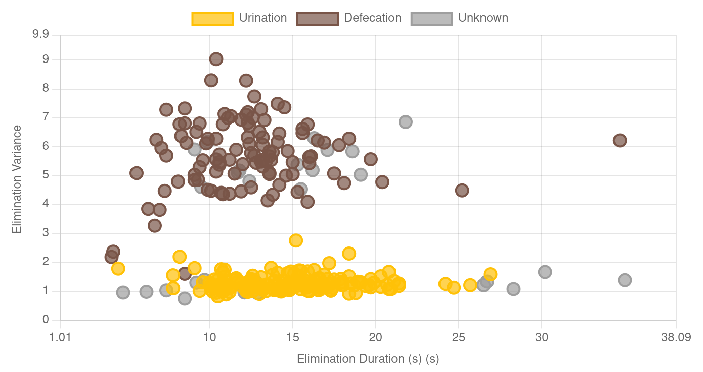
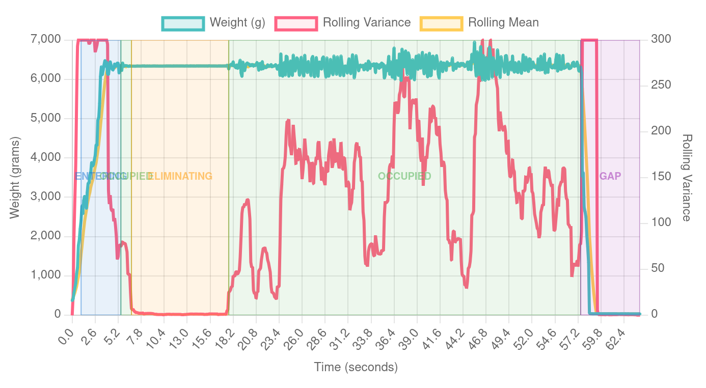
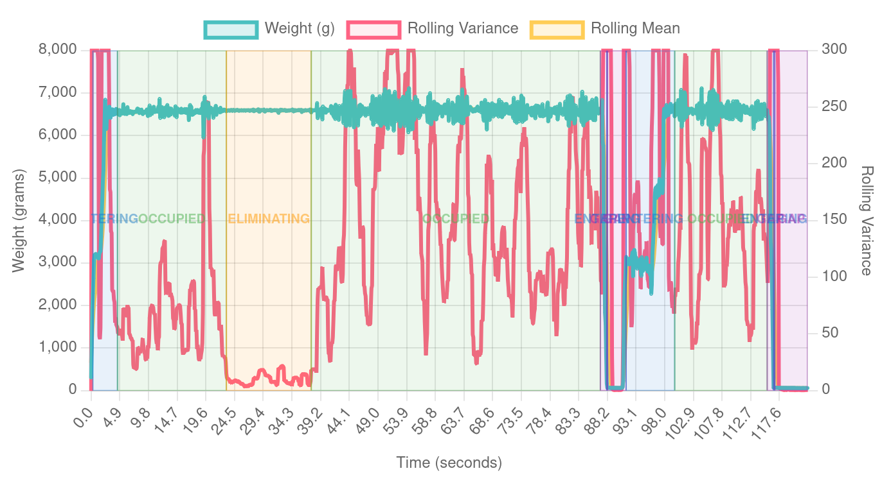

# PoopSense

*Zero-AI[1] waste type recognition for smart litterboxes.*

[1] Zero AI at runtime. Plenty of AI was harmed in the making of this
heuristic.

## The Problem

Knowing whether a cat urinated, defecated, or both is genuinely useful
health data -- changes in frequency or ratio can flag UTIs, constipation,
or dietary issues early.

Most smart litterbox manufacturers offer some form of waste classification
these days -- cloud-based classifiers, camera-fed ML models, on-device
neural nets requiring multiple TOPS of compute, some going as far as
loose stool detection and color-changing pH-reactive litter for urinary
health monitoring.  These are serious products with serious hardware
budgets, and none of it is open-source.

PoopSense is not trying to compete with any of that.  It's a parallel,
open-source effort to see how far you can get with nothing but a load
cell, an ESP32, and some arithmetic.

## The Insight

While a cat is settled and actively eliminating, the scale is essentially a
very sensitive motion sensor.  The key observation:

- **Urination** is a low-motion event.  The cat holds still, and the
  scale reading barely moves.  Weight variance during this period is
  **low** (standard deviation typically < 4 g).

- **Defecation** involves periodic muscular effort.  The cat shifts, braces,
  and pushes.  These micro-movements cause the scale reading to wobble.
  Weight variance is **noticeably higher** (standard deviation > 4 g).

That's it.  The entire classifier is a single threshold on the standard
deviation of the weight signal during an elimination window.  The rest of
the machinery is just figuring out where that window actually is.

## How It Works

PoopSense rides on top of a state machine that tracks what the cat is doing
on the scale in real time, sample by sample at 10 Hz.

### The State Machine

```
EMPTY --> ENTERING --> OCCUPIED <--> ELIMINATING
  ^                      |  ^
  | timeout              |  | weight returns
  +-------- GAP <--------+--+
```

| State | Meaning |
|---|---|
| **EMPTY** | Nothing on the scale. Waiting for weight to cross the entry threshold. |
| **ENTERING** | Something stepped on. Weight is rising and not yet settled. |
| **OCCUPIED** | Weight is present and roughly matches a known cat, but readings are still moving around. The cat is shifting, digging, or getting comfortable. |
| **ELIMINATING** | Weight is stable and close to a known cat value. The cat is sitting still -- likely doing its business. |
| **GAP** | Weight dropped below threshold briefly (repositioning, partial step-off). If weight returns, the session resumes; if the gap times out, the session ends. |

The transition from `OCCUPIED` to `ELIMINATING` is gated by a rolling variance
check over a 1-second window (is the cat holding reasonably
still?), combined with the weight being within 10% of a known cat.
When the cat starts moving again, it drops back to `OCCUPIED`.

This means a single visit can have **multiple** `ELIMINATING` periods --
the cat may urinate, shift, then defecate.

### Post-Processing

When activity ends, the raw state timeline goes through cleanup:

1. **Merge**: Short `OCCUPIED` blips (< 1.5 s) sandwiched between two
   `ELIMINATING` periods get absorbed into one continuous elimination --
   these are just transient body shifts, not real state changes.
2. **Downgrade**: `ELIMINATING` periods shorter than 5 seconds are demoted to
   `OCCUPIED` -- too brief to be a real elimination event.
3. **Collapse**: Consecutive periods of the same state get merged.

### Standard Deviation Calculation

For each surviving `ELIMINATING` period, the population standard deviation of
the raw weight samples is computed.  The first and last 10 samples (~1 s
each) are trimmed to avoid transition noise from the cat settling in or
getting up.

### Classification

| Condition | Result |
|---|---|
| No `ELIMINATING` periods survived | `no_elimination` |
| One period, std dev < 4 g | `urination` |
| One period, std dev >= 4 g | `defecation` |
| Two periods, one below and one above | `both` |
| Anything else | `unknown` |

The 4 g threshold (`SA_URINATION_STD_DEV_THRESHOLD_G`, `"Classification Threshold"`) 
is the only tunable for classification, and in practice it separates 
the two behaviors cleanly.


## Cat Identification & Weight

Cat identification and cat weight measurement are two different problems.
They use different data, tolerate different amounts of noise, and fail in
different ways -- so they're solved separately.

### Identity

Identity is a majority-vote across the entire visit.  Every sample in
`OCCUPIED` or `ELIMINATING` is matched against configured cat profiles
(same 10% band used elsewhere).  The cat with the most matching samples
wins the attribution; if no profile was ever in range, the visit stays
unattributed.

### Visit Weight

Visit weight only considers stable `ELIMINATING` samples, for the same
reason a kitchen scale has a stability indicator: if the load is still
moving, the number isn't meaningful yet.  Samples where the cat is
shifting, digging, or repositioning stay within the 10% identity band
and count toward the vote, but folding them into a weight average
degrades the figure over time.

Of the qualifying stable periods, the longest continuous stretch is
selected and its mean reported.  This is computed independently of the
identity vote.

## Validation

The threshold and state machine were developed against ~2 months of
continuous data from a two-cat household, with every event manually tagged
via a webcam pointed at the litterbox.  Not a huge sample, but enough to
tune the heuristics with confidence that no events were missed or
mislabeled.

Plotting every tagged event by its elimination-phase standard deviation
tells the story pretty clearly -- urination clusters low, defecation
sits higher, and the gap between the two is real if not enormous.



Two representative visits show what the state machine actually sees.
Weight signal and rolling variance are overlaid with the state timeline
-- you can see the `ELIMINATING` window land right where the cat holds
still, with variance near zero for urination and visibly elevated for
defecation.

| Urination | Defecation |
| --- | --- |
|  |  |

## Known Limitations

- **Cats of similar weight** (within ~10%) can't be reliably distinguished.
  This is a fundamental limitation of weight-only identification.

- **Very short eliminations** (< 5 s) are filtered out to avoid false
  positives.  A cat with unusually fast events may occasionally get
  `no_elimination`.

- **Vigilant cats produce false positives.**  A cat that sits motionless
  while scanning for threats looks identical to a cat that's urinating --
  both present as low-variance stillness on the scale.  If your cat tends
  to freeze and surveil mid-visit, expect occasional phantom urination
  events.

- **Diarrhea reads as urination.**  The variance signal depends on the
  physical effort of normal defecation -- the cat braces and shifts, and
  the scale picks that up.  Loose stool passes without any of that, so
  the reading looks identical to urination.  This is worth keeping in
  mind if you're monitoring a cat with GI issues -- the data will
  under-report defecation during flare-ups.

- **The 4 g threshold is empirical.**  It was derived from two cats that
  happened to cluster neatly on either side of it.  Different cats, different
  scale builds, or the same cat at a different age may shift where those
  clusters land.  Different noise floors also play a role.

- **Scale hysteresis hides very small deposits.**  Load cells have a small
  amount of mechanical hysteresis -- a cat can enter, leave nothing, and
  exit, yet the reading shifts by 10-15 g.  A minimum waste threshold is
  applied to avoid false positives, which means genuinely tiny deposits
  (e.g. a few grams of urine during a UTI bout) fall below the noise
  floor and go undetected.  This is a hardware limitation, not a software
  one.


## Load Cell Selection

PoopSense only works as well as the underlying weight signal.  If the
load cell plus ADC combination is too coarse, the classifier can't see
the difference it's looking for.

The decision gap is narrow.  In practice:

- Urination lands around **1-3.5 g** standard deviation
- Defecation lands around **4-10 g**
- The cutoff sits at **4 g**

That's roughly **0.5 g** of daylight between a noisy urination event
and the defecation threshold.  If quantization eats into that margin,
near-threshold events become coin flips.  Rule of thumb:

- **<= 0.25 g/count**: plenty of room
- **0.25-0.5 g/count**: workable, tighter on edge cases
- **> 0.5 g/count**: too coarse -- the classifier starts guessing

### Resolution Table

For common 4-cell bridge configurations. **g/count** values below are
**ballparks** (typical cheap cells, HX711 gain 128, real-world
usable 20-bit resolution):

| Cell Rating | g/count @ 3.3V | Verdict @ 3.3V | g/count @ 5V | Verdict @ 5V |
|---|---|---|---|---|
| 4× 5kg = 20kg | ~0.12 | ✅ | ~0.08 | ✅ |
| 4× 8kg = 32kg | ~0.19 | ✅ | ~0.12 | ✅ |
| 4× 10kg = 40kg | ~0.23 | ✅ | ~0.15 | ✅ |
| 4× 12.5kg = 50kg | ~0.29 | ⚠️ borderline | ~0.19 | ✅ |
| 4× 20kg = 100kg | ~0.58 | ❌ | ~0.38 | ⚠️ borderline |
| 4× 50kg = 200kg | ~1.2 | ❌ | ~0.76 | ❌ |

"Bigger load cells just to be safe" eventually works against you.
Presence detection doesn't care about resolution, but waste-type
classification does -- you need cells rated high enough to handle the
cat, the litter, and the box, but not so high that the ADC can't
resolve a few grams of variance.

## Future Work

**Adaptive threshold calibration.**  The fixed 4 g threshold is a
convenient starting point, but it's really a midpoint between two
clusters -- low-variance (urination) and high-variance (defecation) --
that are specific to each cat and setup.  With a short bootstrapping
period (i.e. a few manually-tagged events of each type), it should be possible
to derive per-cat cluster centers and compute the optimal separator
automatically.  This would also allow the threshold to drift over time as
a cat ages or its habits change, rather than relying on a single static
value that happened to work for the development household.

**Post-elimination digging as confirmation.**  One signal that's visible
in the raw data but not yet exploited: after a real elimination event,
most cats will vigorously cover their waste, producing a distinctive
high-energy burst in the weight signal.  This burst is largely absent
after a non-event (spook, inspection, just passing through).

In theory, detecting a digging phase could serve as a confirmation signal
to reduce false positives from vigilant-cat scenarios.  In practice, the
state machine complexity explodes -- a cat might step out, step back in,
dig, leave, return, dig again -- and modeling all of that purely with
heuristic transitions gets unwieldy fast.  It's a promising direction, but
likely needs a different approach than extending the current state machine.

**Straining detection.**  If PoopSense detects multiple `ELIMINATING`
periods (the cat tried) but no resultant waste above the hysteresis
threshold, that's a potential straining signal worth surfacing.
Correlating this with an audio classifier for vocalization (yowling
during straining is a known distress indicator, and others are already
exploring audio-based detection) could make it more robust, though that's
firmly in sensor-fusion territory.

**Actionable insights.**  Right now PoopSense classifies and reports --
it doesn't act on what it finds.  The interesting part (trending
elimination patterns over time, flagging deviations from a cat's
baseline, alerting when something looks off) lives outside this repo,
in a separate application built to aggregate and surface that data.

In principle, this could happen on-device: an ESP32 has enough headroom
to maintain rolling baselines and fire alerts over MQTT or ESPNow,
and multi-litterbox households could synchronize state between nodes to
get a complete picture per cat.  But that's a substantial layer of
complexity on top of what is currently a sensor firmware, and it hasn't
been built yet.

## Implementation

The entire implementation lives in
[`state_analyzer.h`](state_analyzer.h) -- a single C++ header included
by the ESPHome configuration.  No external dependencies, no network
calls, no cloud.  It runs comfortably within the memory and CPU budget
of an ESP32.

---

*A note on naming:* Every smart litterbox brand has a fancy trademarked
name for their waste classifier.  PoopSense is silly; the effort behind
it isn't.
